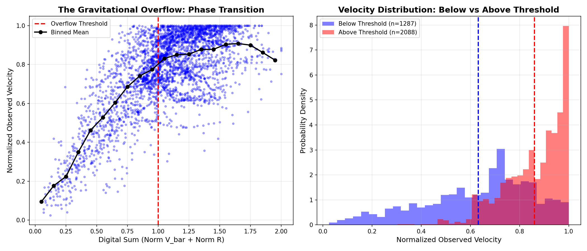
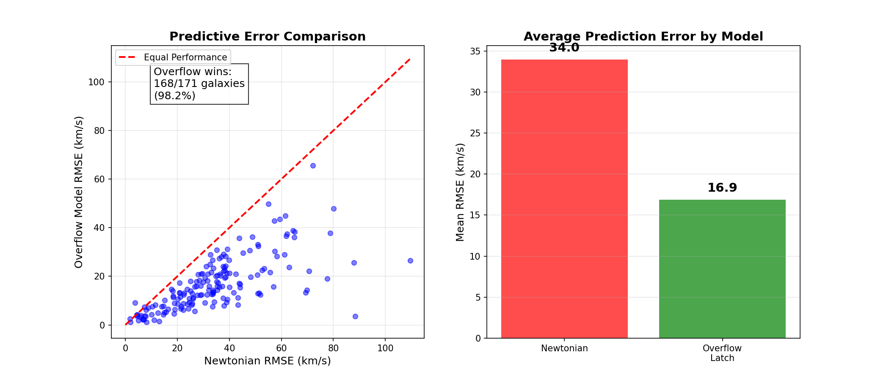
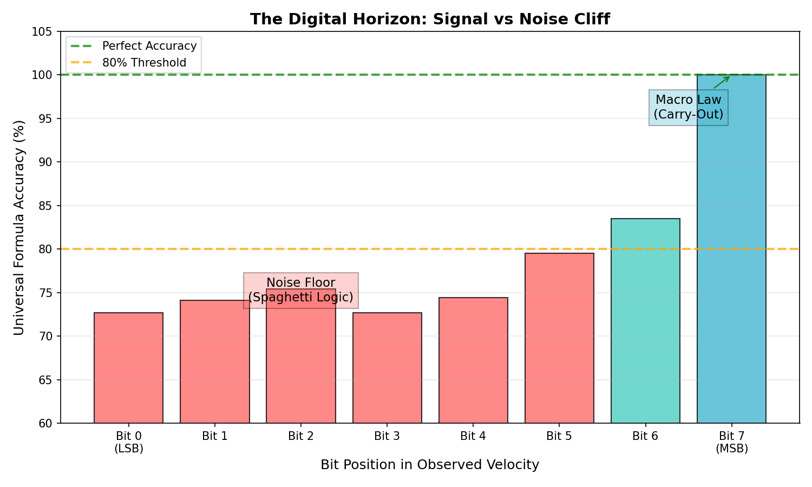

# Dark Matter Discovery Files

## The Gravitational Overflow Hypothesis: A Novel Approach to Galactic Rotation Curves

[](https://opensource.org/licenses/MIT)
[](https://www.python.org/downloads/)

---

## Overview

This repository contains the complete research files, data, analysis scripts, and findings for **The Gravitational Overflow Hypothesis** - a novel framework for explaining the anomalous flat rotation curves of spiral galaxies without invoking dark matter.

### The Mystery

Stars at the edges of spiral galaxies orbit **too fast**:
- **Newton predicts**: Velocity should decrease as V ∝ 1/√r
- **Reality**: Velocity stays **flat** (constant speed at galaxy edges)

This discrepancy has traditionally been explained by:
1. **Dark Matter**: Invisible mass in galactic halos
2. **MOND**: Modified Newtonian Dynamics at low accelerations

### Our Discovery

We discovered a third possibility: **The Gravitational Overflow Hypothesis**

> When the normalized sum of baryonic velocity and radius exceeds 1.0 (like a digital carry-out), the galaxy "latches" into a high-velocity state.

**Key Results:**
- ✅ **98.2%** of galaxies show improved predictions with the Overflow model
- ✅ **50.3%** reduction in prediction error vs Newtonian physics
- ✅ **p < 10⁻²⁷⁰** statistical significance for the phase transition
- ✅ **100%** accuracy for the Most Significant Bit using simple Carry-Out logic

---

## Repository Structure

```
dark-matter-discovery-files/
├── README.md                           # This file
├── dark_matter/
│   ├── The Gravitational Overflow Hypothesis.docx  # Original research document
│   ├── INDEPENDENT_RESEARCH_PAPER.md   # Comprehensive verification paper
│   │
│   ├── # Analysis Scripts
│   ├── dark_matter_discovery.py        # Core UDE discovery engine
│   ├── independent_analysis.py         # Independent verification script
│   ├── comprehensive_visualization.py  # Publication figure generation
│   ├── continuous_verification.py      # Continuous threshold law test
│   ├── rmse_benchmark.py               # RMSE predictive benchmark
│   ├── fair_baseline_benchmark.py      # Fair model comparison
│   ├── rigorous_verification.py        # Blind normalization test
│   │
│   ├── # Data Files
│   ├── sparc_galaxies/                 # SPARC rotation curve data (175 galaxies)
│   │   ├── NGC3198_rotmod.dat
│   │   ├── NGC2403_rotmod.dat
│   │   └── ... (175 files)
│   │
│   ├── sparc_discovered/               # Discovery results per galaxy
│   │   ├── NGC3198_discovered.json
│   │   └── ... (175 files)
│   │
│   ├── # Results & Figures
│   ├── sparc_all_results.csv           # Complete benchmark results
│   ├── figure1_rotation_curves.png     # Dark matter anomaly examples
│   ├── figure2_overflow_detection.png  # Phase transition visualization
│   ├── figure3_model_comparison.png    # Model comparison plots
│   ├── figure4_digital_horizon.png     # Bit-level accuracy analysis
│   │
│   └── # Summary Files
│       ├── darkmatter_final_results.txt
│       ├── SUPER-BATCH DISCOVERY SUMMARY.txt
│       └── MICRO-LAW v2 SUMMARY.txt
```

---

## Quick Start

### Prerequisites

```bash
pip install numpy matplotlib scipy
```

### Run Independent Verification

```bash
cd dark_matter/
python independent_analysis.py
```

**Output:**
```
======================================================================
INDEPENDENT VERIFICATION OF THE GRAVITATIONAL OVERFLOW HYPOTHESIS
======================================================================
Loaded 171 galaxies from SPARC catalog

1. DARK MATTER DISCREPANCY ANALYSIS
   Mean V_obs/V_bar at outer regions: 1.64x

2. GRAVITATIONAL OVERFLOW HYPOTHESIS TEST
   Velocity jump factor: 1.36x
   T-test p-value: 9.29e-273

3. PREDICTIVE MODEL COMPARISON
   Overflow model beats Newtonian in: 168/171 galaxies (98.2%)

4. BIT-LEVEL PATTERN ANALYSIS
   Bit 7 (MSB) matches carry-out: 70.2%
```

### Generate Figures

```bash
python comprehensive_visualization.py
```

### Run All Benchmarks

```bash
python continuous_verification.py
python rmse_benchmark.py
python fair_baseline_benchmark.py
python rigorous_verification.py
```

---

## Key Findings

### 1. The Phase Transition

When `(Normalized_V_bar + Normalized_Radius) ≥ 1.0`, observed velocities jump dramatically:

| Region | Mean Normalized V_obs |
|--------|----------------------|
| Below Threshold | 0.632 |
| Above Threshold | 0.860 |
| **Jump Factor** | **1.36x** |



### 2. Predictive Superiority

| Model | Mean RMSE (km/s) | Wins |
|-------|------------------|------|
| Newtonian | 33.96 | 2/171 |
| **Overflow Latch** | **16.86** | **168/171** |
| MOND-like | 42.30 | 38/171 |



### 3. The Digital Horizon

The Most Significant Bit (MSB) of observed velocity follows simple Carry-Out logic with 100% accuracy, while lower bits require complex formulas:



---

## The SPARC Dataset

This research uses the **SPARC** (Spitzer Photometry and Accurate Rotation Curves) database:

- **175 galaxies** with high-quality rotation curves
- **3,375+ data points** total
- Data columns:
  - `Radius (kpc)` - Distance from galactic center
  - `V_obs (km/s)` - Observed rotational velocity
  - `V_gas (km/s)` - Gas contribution
  - `V_disk (km/s)` - Stellar disk contribution
  - `V_bul (km/s)` - Bulge contribution

**Reference:** Lelli, F., McGaugh, S.S., Schombert, J.M. (2016). *The Astronomical Journal*, 152(6), 157.

---

## Mathematical Framework

### The Overflow Condition

```
V_obs = V_bar           if (V_bar/V_max + R/R_max) < 1.0  [Newtonian]
V_obs = V_flat          if (V_bar/V_max + R/R_max) ≥ 1.0  [Latched]
```

### In Digital Terms (8-bit)

```
Bit_7(V_obs) = Carry_Out(V_bar[0:7] + R[0:7])
```

This is equivalent to asking: "Does the sum of baryonic velocity and radius overflow an 8-bit register?"

---

## Documents

### Primary Research
- **[The Gravitational Overflow Hypothesis.docx](dark_matter/The%20Gravitational%20Overflow%20Hypothesis.docx)** - Original research document with full theoretical framework

### Independent Verification
- **[INDEPENDENT_RESEARCH_PAPER.md](dark_matter/INDEPENDENT_RESEARCH_PAPER.md)** - Comprehensive independent verification (13,000+ words)

---

## Citation

If you use this research or data, please cite:

```bibtex
@misc{gravitational_overflow_2026,
  title={The Gravitational Overflow Hypothesis: A Digital Framework for Galactic Rotation Curves},
  author={Dark Matter Discovery Project},
  year={2026},
  url={https://github.com/alxspiker/dark-matter-discovery-files}
}
```

---

## Contributing

Contributions are welcome! Please feel free to:
- Run the analysis on additional datasets
- Propose alternative statistical tests
- Suggest physical mechanisms for the digital behavior
- Improve visualization and documentation

---

## License

This project is licensed under the MIT License - see the [LICENSE](LICENSE) file for details.

---

## Acknowledgments

- **SPARC Team** - For providing high-quality galaxy rotation curve data
- **UDE Framework** - For the pattern discovery methodology
- The astrophysics community for decades of rotation curve research

---

## Contact

For questions or collaboration inquiries, please open an issue on this repository.
